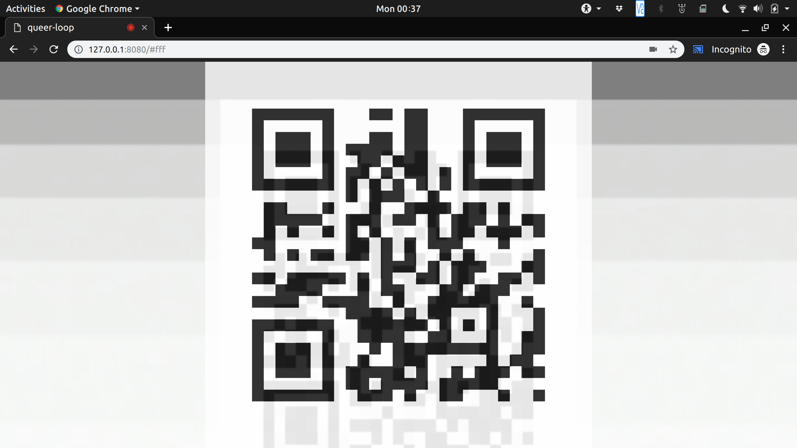

# queer-loop (WIP)

[](https://qqq.lu)

[queer-loop](https://qqq.lu) is a simple [ReasonML](https://reasonml.github.io/)
app that generates and reads Q(uee)R codes. Q(uee)R codes are QR codes that
follow a sequence, which will progress only when the app recognizes another
Q(uee)R code. (The name is a playful reference to the notion of a [strange
loop](https://en.wikipedia.org/wiki/Strange_loop) as elaborated by Douglas
Hofstadter.)

Only tested in Chrome (on desktop web and Android mobile).

**NOTE: this does not yet work in iOS. Switching to a different QR scanning
library may be needed... stay tuned.**

## Usage

Clicking (or tapping the screen) will cycle between available cameras on your
device.

Here are a few ways I've found so far to play with queer-loop:

- open two copies of it on different devices and point their screens/cameras at
  each other
- hook up a capture card (I use the ClonerAlliance Flint LXT) to a Chromecast,
  and cast...:
    - a phone camera to it
    - the tab to itself

So far, I've not been able to get queer-loop to work by pointing a phone's
front-facing camera at a mirror, though I figure it ought to be possible. I
suspect it's due to the difficulty in recognizing the barcode at even a slight
angle (at least using the current library). I'd **love** to get that working --
suggestions welcome!

## Future Work

Currently, the sequence is simply counting through 4096 RGB colors in
lexicographic order, but there are innumerable possibilities here. Possible
directions I hope to explore include:

- cycling in some kind of HSV/rainbow order instead (Pride edition!)
- encoding more than just color (using Base64)

By adopting a Base64 format, a whole range of things could be stored in QueeR
code. For instance, the state of a [reversible cellular
automaton](https://en.wikipedia.org/wiki/Reversible_cellular_automaton)... :)

## Development



This is very much a WIP, so the ergonomics of working with the code are poor at
present. License is GPL v3.

### Requirements

- [yarn](https://yarnpkg.com/)

Only tested on Ubuntu 18.10, but should work anywhere.

### Build + Watch

In different terminals (or tmux splits), run:

```
yarn start
```

```
webpack -w
```


```
http-server
```

Alternatively, you could run all three in a subshell, e.g.:

```( yarn start &; webpack -w &; http-server &; )```
